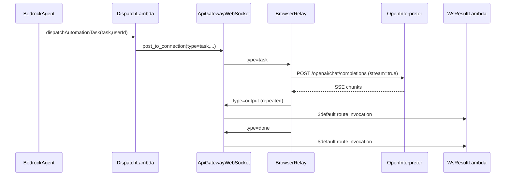

# Computer Use Message Protocol

This document defines the wire protocol between:

- Dev 2 dispatch Lambda (`functions/automation/dispatch.py`)
- API Gateway WebSocket routes
- Browser relay (`computer-use/relay/OIRelay.ts`)
- Local Open Interpreter server (`http://localhost:8000/openai/chat/completions`)
- Result handler Lambda (`computer-use/lambdas/ws_result.py`)

## Transport

- **WebSocket endpoint:** `wss://<api-id>.execute-api.<region>.amazonaws.com/<stage>`
- **Auth:** Cognito JWT passed as query param on connect: `?token=<idToken>`
- **Payload format:** UTF-8 JSON messages

## Message Types

### 1) Lambda -> Browser Relay: `task`

Sent by dispatch Lambda to a user-specific WebSocket connection.

```json
{
  "type": "task",
  "taskId": "1e1d0f72-51aa-47cb-a5b8-3df0f29f1cad",
  "userId": "cognito-sub",
  "sessionId": "optional-session-id",
  "task": "Open Chrome and summarize unread emails"
}
```

Required fields: `type`, `userId`, `task`

Notes:

- `taskId` should be included by dispatcher when available.
- Relay generates a UUID if `taskId` is omitted (for compatibility with the current `functions/agent/dispatch.py` placeholder path).

### 2) Browser Relay -> Lambda: `output`

Sent repeatedly while Open Interpreter streams partial output.

```json
{
  "type": "output",
  "taskId": "1e1d0f72-51aa-47cb-a5b8-3df0f29f1cad",
  "sessionId": "optional-session-id",
  "data": "partial chunk text"
}
```

Required fields: `type`, `taskId`, `data`

### 3) Browser Relay -> Lambda: `done`

Sent exactly once when the task stream completes.

```json
{
  "type": "done",
  "taskId": "1e1d0f72-51aa-47cb-a5b8-3df0f29f1cad",
  "sessionId": "optional-session-id",
  "result": "final summarized output"
}
```

Required fields: `type`, `taskId`

### 4) Browser Relay -> Lambda: `error`

Sent when relay or local Open Interpreter execution fails.

```json
{
  "type": "error",
  "taskId": "1e1d0f72-51aa-47cb-a5b8-3df0f29f1cad",
  "sessionId": "optional-session-id",
  "message": "Open Interpreter not running on localhost:8000"
}
```

Required fields: `type`, `taskId`, `message`

## Open Interpreter Request Contract

The relay calls Open Interpreter with OpenAI-compatible streaming:

`POST http://localhost:8000/openai/chat/completions`

```json
{
  "model": "gpt-4o-mini",
  "stream": true,
  "messages": [
    {
      "role": "user",
      "content": "Open Chrome and summarize unread emails"
    }
  ]
}
```

Notes:

- `model` is required by protocol, but Open Interpreter may ignore it.
- Relay parses SSE lines prefixed by `data:`.

## Validation Rules

- `taskId` is required across all task lifecycle messages.
- Unknown message `type` values should be ignored and logged.
- `error` should always include a user-readable `message`.
- Empty `task` values must be rejected by dispatch before send.

## State Transitions

`ws_result.py` maintains task lifecycle:

- On first `output`: set `status=running`
- On each `output`: append chunk to incremental output log
- On `done`: set `status=complete`, persist `result`
- On `error`: set `status=failed`, persist `result=<message>`

## Sequence



## Compatibility Notes

- Current `functions/agent/dispatch.py` in repo returns a `503 pending_dev3` stub and does not yet emit WebSocket messages.
- `sessionId` is optional and should be forwarded transparently when present.
- For future dispatch implementation, prefer explicitly setting `taskId` in outbound task messages.
